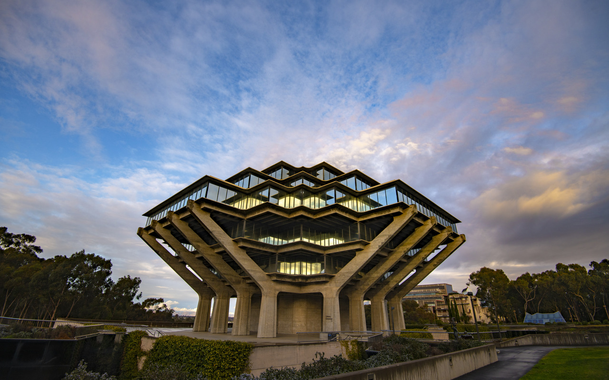

# About me

***Table of Contents***

[Introduction](#introduction)

[Who I am as a person](#who-i-am-as-a-person)

[Link to picture of me](#here-is-a-picture-of-me)

[Who I am as a programmer](#who-i-am-as-a-programmer)

## Introduction
Hi, my name is Leah Kuruvila and I am a second year computer science major at UCSD. 

### Here is a picture of me:
[click on this link to see a picture of me](me.JPG)

## Who I am as a person
I love to **read**, **bake**, do **yoga**, and go to the **beach**, hang out with **family/friends** as well as my **dog**. 

Here are some pictures of things I *love*:
 

>a picture of the sunrise I took

>my dog

>my school

It is important to me that I maintain different interests in my life so I can continue to **further and build myself in more than one way**. I am always open to **trying new things and experiences**. I love being a student at **UCSD** because it has **helped me grow tremendeously** and I am sure I will continue to during my time here.

## Who I am as a programmer
I love to `code` because I the process of using language to create something useful. My favorite programming language is `python` because it is special to me since it is the first language I learned and introduced me to programming. I embrace the `challenges` and `debugging` since I recognize it as an important part of programming that makes my end result feel much more `rewarding`. I am excited to see what I `create` next!